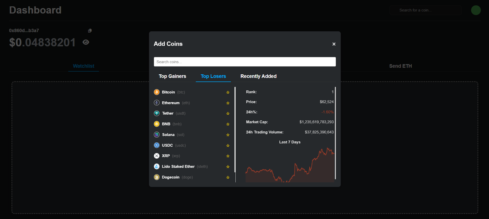
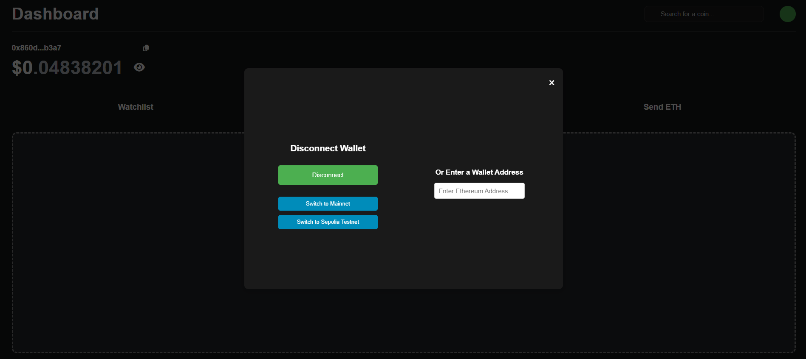
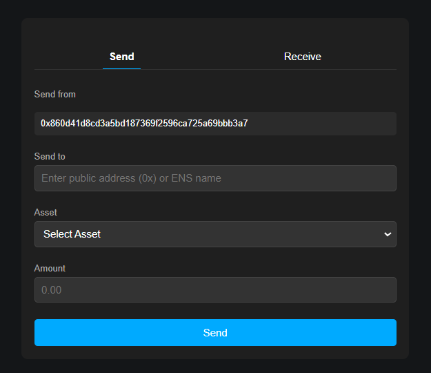
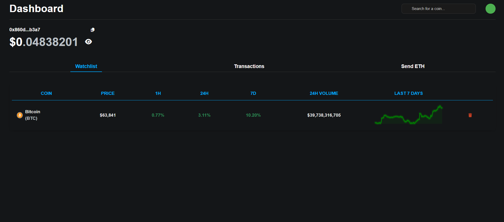
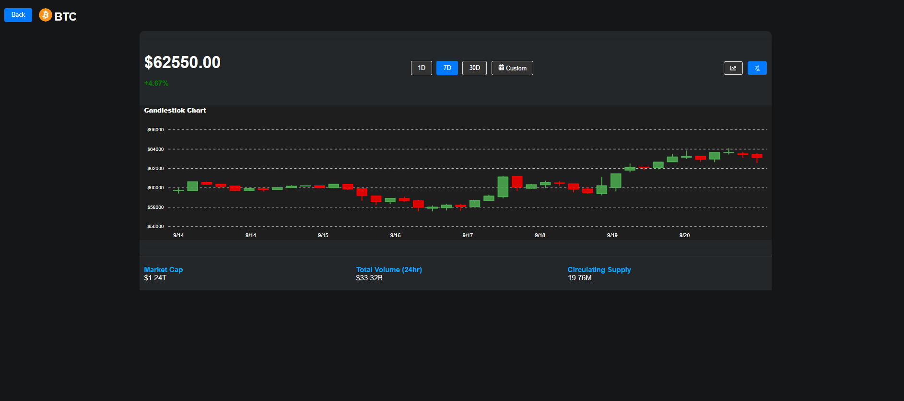

# Crypto-Portfolio App

## Table of Contents

- [Project Overview](#project-overview)
- [Features](#features)
- [Demo](#demo)
- [Technologies Used](#technologies-used)
- [Getting Started](#getting-started)
  - [Prerequisites](#prerequisites)
  - [Installation](#installation)
  - [Running the Application](#running-the-application)
- [Pages](#pages)
- [Usage](#usage)

## Project Overview

Crypto-Portfolio App is a single-page application (SPA) that empowers users to effectively manage their cryptocurrency portfolios. This app offers a range of features including:

- **Wallet Integration:** Connect and manage your cryptocurrency wallets seamlessly.
- **Token Tracking:** Add and monitor various tokens in your watch list.
- **Real-Time Balance Monitoring:** View current balances for each token with live updates.
- **Historical Data Analysis:** Access and analyze historical balance data based on selected dates.
- **Allowance Management:** Check and manage token allowances for different smart contracts.
- **Token Operations:** Perform essential token operations such as transferring tokens or approving allowances.
- **Visual Data Representation:** Utilize interactive tables, charts, and graphs to visualize token performance and portfolio distribution.

Leveraging modern frontend technologies like React.js and blockchain interaction libraries such as Ethers.js, Crypto-Portfolio App provides a user-friendly and efficient platform for both novice and experienced cryptocurrency enthusiasts to oversee and optimize their digital asset holdings.

## Features

1. **Wallet Connection**
   - Connect your MetaMask or any other supported wallet.
   - Option to input a wallet address manually.

2. **Watch List**
   - Add and manage various tokens in your watch list.
   - Display current balance for each token in real-time.

3. **Historical Data**
   - Fetch and display historical balances of tokens.
   - Utilize a date picker to select specific date ranges.

4. **Allowance Management**
   - Check token allowances for different smart contracts.

5. **Token Operations**
   - Transfer tokens to another address.
   - Approve tokens for specific operations.

6. **Visual Representations**
   - Interactive tables, charts, and graphs to visualize token data.
   - Creative and intuitive data presentation for enhanced user experience.

## Demo

Experience the Crypto-Portfolio App live!

  
  
  
  


## Technologies Used

- **Frontend:** React.js
- **Blockchain Interaction:** Ethers.js
- **Styling:** CSS Modules
- **State Management:** React Context API
- **Charts & Graphs:** Chart.js, Sparklines
- **Routing:** React Router
- **HTTP Client:** Axios
- **Deployment:** Vercel/Netlify

## Getting Started

### Prerequisites

- **Node.js** (v14 or later)
- **npm** or **yarn**
- **MetaMask** extension (for wallet connection)

### Installation

1. **Clone the repository:**

    ```bash
    git clone https://github.com/your-username/crypto-portfolio-app.git
    ```

2. **Navigate to the project directory:**

    ```bash
    cd crypto-portfolio-app
    ```

3. **Install dependencies:**

    ```bash
    npm install
    # or
    yarn install
    ```

4. **Set up environment variables:**

    - Create a `.env` file in the root directory.
    - Add necessary environment variables as per the `.env.example` file.

### Running the Application

1. **Start the development server:**

    ```bash
    npm start
    # or
    yarn start
    ```

2. **Open your browser and navigate to:**

    ```
    http://localhost:3000
    ```


## Pages

- **HomePage:** Main dashboard for managing tokens, viewing balances, and monitoring transactions.
- **NotFound:** Fallback page for undefined routes.
- **TokenDataPage:** Displays comprehensive data and charts for specific tokens.

## Usage

1. **Connect Your Wallet**
   - Click on the "Connect Wallet" button.
   - Choose your preferred wallet provider (e.g., MetaMask).
   - Alternatively, input your wallet address manually.

2. **Manage Watch List**
   - Navigate to the Watch List section.
   - Add new tokens by searching and selecting them.
   - View current balances and manage your tokens.

3. **View Historical Data**
   - Select a token from your watch list or wallet tokens.
   - Use the date picker to choose a date range.
   - Analyze historical balance changes through interactive charts.

4. **Check Allowances**
   - Access the Allowance section.
   - View and manage token allowances for different smart contracts.

5. **Perform Token Operations**
   - Navigate to the Send Transaction section.
   - Enter the recipient's address, select the asset, and specify the amount to transfer.
   - Confirm the transaction through your connected wallet.

6. **Monitor Transaction History**
   - View your past transactions in the Transaction History section.
   - Check details like transaction hash, block number, sender, and data.

